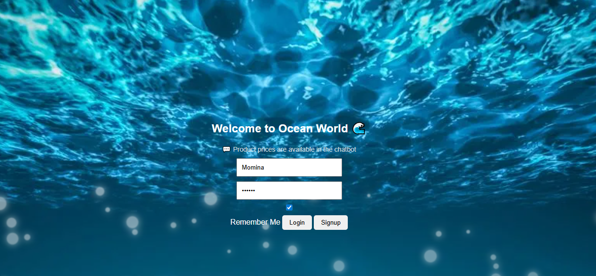
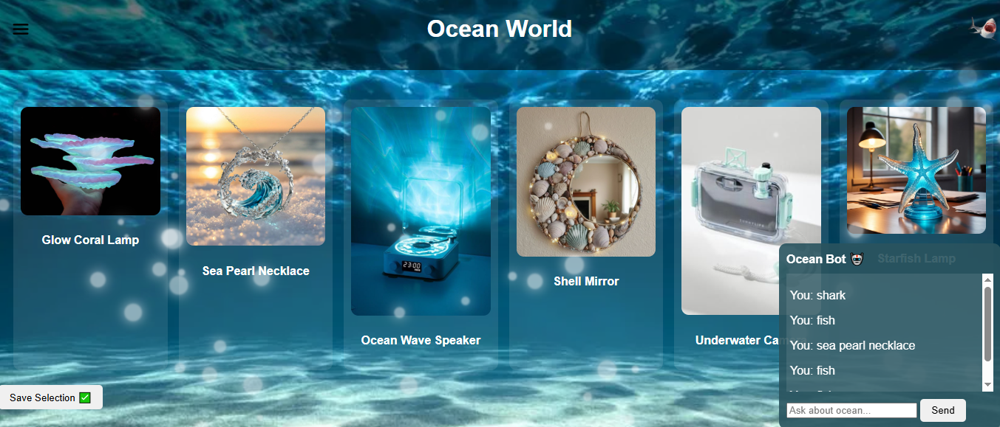
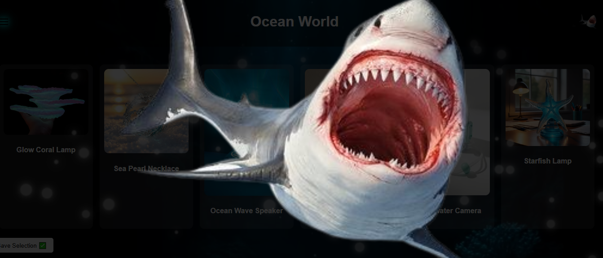
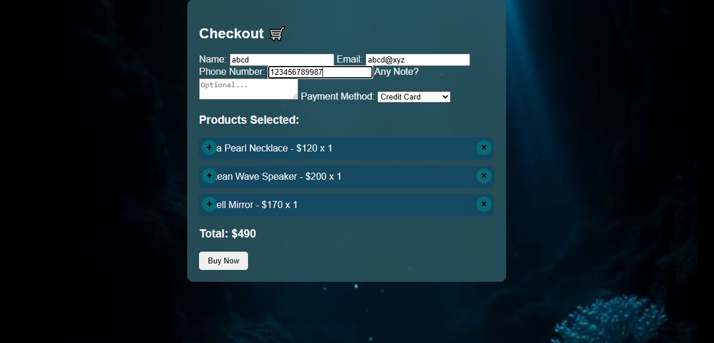

# Ocean World 🌊

A visually stunning, interactive underwater-themed web application that simulates a virtual ocean store experience. Explore products, interact with a chatbot, and enjoy immersive ocean animations.

---

## Features

- **Interactive UI** with underwater theme, realistic bubbles, and floating effects  
- **Chatbot** to provide product details and ocean facts  
- **Product Selection & Add-to-Cart**: select multiple products, save selection, and proceed to checkout  
- **Checkout Page**: displays selected products, quantities, and calculates total bill  
- **Dark Mode**: toggle between day and night ocean themes  
- **Shark Animation**: click the shark icon to trigger a full-screen shark animation with sound  
- **Remember Me Login**: saves username and password for faster login  
- **Floating Bubbles & Ocean Effects**: visually immersive underwater feel  

---

## Screenshots

### Home Page
  

### Products Section
  

### Chatbot Feature
  

### Dark Mode
  

### Shark Animation
  

### Checkout Page
  

---

## How to Use

1. Clone the repository or download the folder.
2. Open `index.html` in your browser.
3. Signup or login to start exploring the products.
4. Use the sidebar to:
   - View products  
   - Interact with the chatbot  
   - Toggle dark mode  
   - Open cart and select products  
5. Save your selected products and proceed to checkout to view the total bill.
6. Click the shark icon for a fun animation with sound!  

---

## Technologies Used

- HTML, CSS, JavaScript  
- LocalStorage for storing login info, cart, and recent queries  

---

## Notes

- This is a front-end only project; all data is stored locally in the browser.  
- For best experience, open in a modern browser with JavaScript enabled.  
